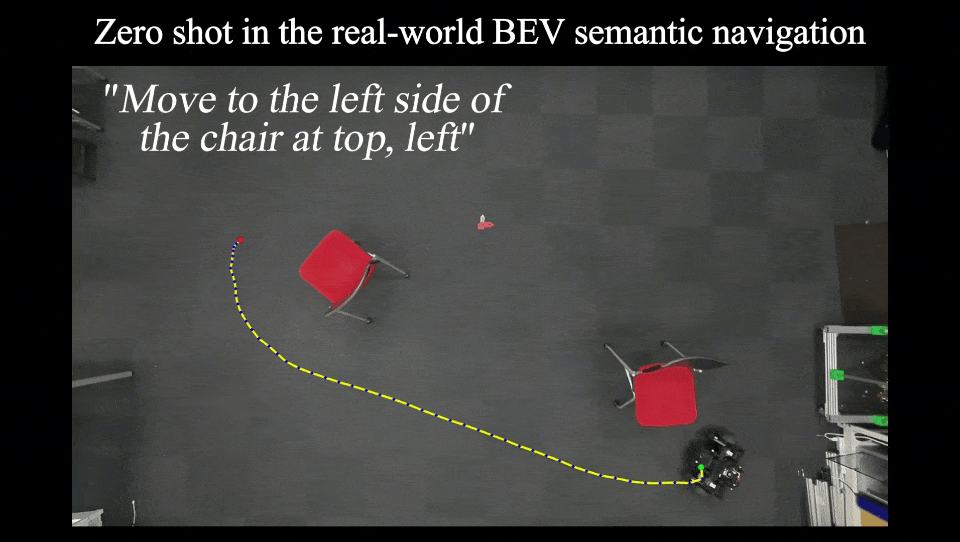
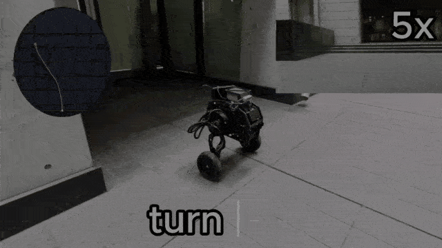

# CoFL

Continuous flow-field policies for language-conditioned navigation.

<table>
  <tr>
    <th width="50%">CoFL · Bird's-eye-view navigation</th>
    <th width="50%">CoFL-S · Egocentric RGB-D navigation</th>
  </tr>
  <tr>
    <td align="center">
      <a href="https://youtu.be/gccph7X3fFg">
        
      </a>
    </td>
    <td align="center">
      <a href="https://youtu.be/NJpWBFihxbo">
        
      </a>
    </td>
  </tr>
  <tr>
    <td align="center"><a href="https://youtu.be/gccph7X3fFg">▶ Watch CoFL on YouTube</a></td>
    <td align="center"><a href="https://youtu.be/NJpWBFihxbo">▶ Watch CoFL-S on YouTube</a></td>
  </tr>
</table>

The first model and dataset release covers **CoFL-S**: its RGB-D checkpoint
and the matching R2R/RxR training and validation collection. CoFL image-field
weights and datasets are deferred. The source release includes both methods
and their shared implementation. The [CoFL-S model repository](https://huggingface.co/lhk66666/CoFL-S)
provides the checkpoint and a matching source snapshot. The
[dataset page](https://huggingface.co/datasets/lhk66666/CoFL-S-Dataset) tracks
archive availability and access terms; see the [release scope](docs/data-release.md).

| Method | Inputs and queries | Predicted field | Paper |
| --- | --- | --- | --- |
| **CoFL** | Bird's-eye-view RGB and language; image coordinates | Image-plane vectors | [Continuous Flow Fields for Language-Conditioned Navigation](https://arxiv.org/abs/2603.02854) |
| **CoFL-S** | Egocentric RGB-D and language; local sector coordinates | Body-frame forward/left vectors | [Spatially Queryable Sector Flow Fields for Local Language-Conditioned Navigation](https://arxiv.org/abs/2607.02222) |

Both policies share a SigLIP encoder, pooled text tokens, masked pre-norm fusion,
and context normalization. CoFL-S adds depth injection and an action head.
Their field decoders and coordinate conventions remain distinct.

## Installation

The locked environment targets **Linux x86_64, Python 3.12.12 and uv 0.12.10**.
It creates an independent `.venv` with PyTorch 2.5.1, Torchvision 0.20.1,
Lightning 2.5.5 and the training, evaluation, host-side generation and test
dependencies. Run these commands from the repository root after cloning:

```bash
curl -LsSf https://astral.sh/uv/0.12.10/install.sh | sh
source "$HOME/.local/bin/env"
uv sync --locked
uv run --locked cofl --help
```

The [official uv installer](https://docs.astral.sh/uv/getting-started/installation/)
supports versioned installations. uv manages its own Python installation;
`.python-version` selects Python 3.12.12 independently of system Python or Conda.
`uv.lock` fixes the dependency resolution. `--locked` checks that the lock
matches the project without updating it. The default dependency groups are
`dev` and `cu124`, using the official PyTorch CUDA 12.4 wheels. GPU training
requires an NVIDIA GPU with a compatible driver.

For CPU use, select the `cpu` dependency group instead of `cu124` for both
synchronization and every run:

```bash
uv sync --locked --no-group cu124 --group cpu
uv run --locked --no-group cu124 --group cpu cofl --help
```

`cpu` and `cu124` are mutually exclusive dependency groups. The commands below
use the default CUDA environment; use the CPU prefix above for CPU execution
and select CPU in the task configuration. The full internal Python and browser
test suites are not included in the public release. Dataset and checkpoint
downloads are separate from environment setup; check the release pages above
for availability and download instructions.

## Interactive app

CoFL Studio separates **BEV** and **2D egocentric** workspaces:

| Domain | Tasks |
| --- | --- |
| **BEV** — CoFL / `image_field_v1` | **Scene Playground**: GLB camera navigation, floor cutaways, and click-to-query trajectories. **Val Inspector**: native image-field labels and predictions. |
| **2D egocentric** — CoFL-S / `ground_sector_v1` | **Interactive Playground**: open a Habitat scene and control the policy with live instructions, pause and reset. **VLN Benchmark**: fixed episodes with oracle instruction progress, trajectories and metrics. |

With Node.js 20.19+ or 22.12+ and npm installed, build and launch from this checkout:

```bash
uv run --locked cofl app --build
```

Open `http://127.0.0.1:8787`, choose a domain, and use **Load policy** to select a
checkpoint. **BEV → Val Inspector → Open dataset** opens a native dataset and
split. In either egocentric task, **Open benchmark** selects a YAML environment
recipe for your Habitat interpreter and scene assets; benchmark evaluation also
requires episode data. The Interactive Playground opens a scene before you send
an instruction and accepts new commands during exploration. Benchmark episodes
can transfer their current scene and pose into free exploration.

Studio uses `cuda:0` by default. If GPU inference is unavailable or fails, the
interface asks before switching to CPU. You can also explicitly select CPU with
`--device cpu` or `device: cpu` in the Studio configuration.

Use **Shut down Studio** in the sidebar to stop sessions, unload model and
dataset resources, and exit the local server. Closing a browser tab alone keeps
Studio running so refreshing or reconnecting can recover the active session.

Resources are read directly from the Studio machine without restarting. The UI
filters known resource metadata, and the backend validates the actual method
and profile before use. Startup resources are verified when selected. The
included two-floor BEV example supports scene exploration without a checkpoint.
Resources can also be supplied at startup:

```bash
uv run --locked cofl app --scene room.glb --checkpoint policy.ckpt \
  --dataset datasets/cofl --device cuda:0
```

Use `--config` for multiple resources, environment recipes and floor elevations.
The `python -m cofl.online` batch CLI and Studio VLN Benchmark use the same
runner, oracle, controller, clock, STOP and metric protocol. Habitat can run in
its own Python process. CoFL-S still uses its native single-frame RGB-D model;
protocol migration does not establish numerical reproduction of SecVLA model
results. See the [Studio guide](docs/app.md) for setup, resumable CLI outputs,
configuration, coordinate conventions, validation scope and 3D domain extension.

## Datasets

Training consumes prepared datasets. Users do not need a simulator or the label
generation pipeline to train a released dataset.

The CoFL-S dataset and checkpoint downloads are being prepared. This first
release provides versioned, precomputed packages with fixed splits, native
Parquet/Zarr data, geometry metadata and SHA-256 checksums. See the
[data release plan](docs/data-release.md) for hosting and access details.

Place the downloaded and unpacked datasets at:

```text
datasets/
  cofl-s/     # ground_sector_v1; train and val_unseen
```

Each dataset root contains a native `manifest.json` or a `collection.json`
indexing its shards. Validate the selected dataset before training:

```bash
uv run --locked cofl data validate datasets/cofl-s
```

## Training

The supplied configurations use SigLIP 2 and online Weights & Biases logging
in project `CoFL`. Initial training downloads the pretrained SigLIP assets
from Hugging Face. Configure W&B `entity` if you use a team account.

After preparing the datasets, authenticate W&B and run either method on an
available GPU:

```bash
uv run --locked wandb login
```

```bash
uv run --locked cofl train --config configs/cofl_formal.yaml
```

```bash
uv run --locked cofl train --config configs/cofl_s_formal.yaml
```

Lightning manages training, validation, best-checkpoint selection and early
stopping after warmup. Its WandbLogger records metrics and configuration,
alongside standard W&B hardware and console logs. Use `uv run --locked cofl train --help`
for the standard LightningCLI options. See [training](docs/training.md)
for the field-loss options, sampling and validation protocol.

## Checkpoints and inference

Every checkpoint contains the complete policy, including **SigLIP vision/text
weights, model configurations, image processor and tokenizer assets**.
Evaluation and resume reconstruct the model from that one file; they do not
read a pretrained-model directory or download SigLIP.

| File | Purpose |
| --- | --- |
| `last.ckpt` | Complete policy and Lightning training state for resume |
| `best.ckpt` | Complete policy and training state at the lowest validation loss |

Lightning writes checkpoints under `outputs/<method>/CoFL/<run-id>/checkpoints/`
with the supplied logger. Copy `<run-id>` from your W&B run URL and pass it
explicitly to continue logging to that run:

```bash
uv run --locked cofl train --config outputs/cofl/config.yaml \
  --ckpt_path "outputs/cofl/CoFL/<run-id>/checkpoints/last.ckpt" \
  --trainer.logger.init_args.id "<run-id>" --trainer.logger.init_args.resume allow
```

The CoFL offline evaluation recipe scores image fields and image-navigation
trajectories. It processes the complete eligible validation split by default
and produces a local HTML report with figures, per-sample CSV/JSONL records
and aggregate metrics. The locked environment includes the evaluator;
supply the prepared dataset and one complete checkpoint:

```bash
uv run --locked cofl evaluate --config configs/evaluation/cofl.yaml \
  --dataset datasets/cofl \
  --checkpoint "outputs/cofl/CoFL/<run-id>/checkpoints/best.ckpt" \
  --output artifacts/evaluation/cofl
```

Open `artifacts/evaluation/cofl/report.html`. Repeating the command resumes
committed batches from SQLite after
checking the checkpoint, code, data and cohort identities. See
[evaluation protocols](docs/benchmarks.md) for sampling, metric units and
failure counts. CoFL-S closed-loop Habitat/VLN evaluation is available through
`python -m cofl.online`. The [R2R-1200](benchmarks/r2r_1200/README.md) and
[RxR-1600](benchmarks/rxr_1600/README.md) datasets provide fixed episode IDs
and annotation preparation for the custom subsets selected for this task.
Neither is the official full split. Model, runtime and output
settings live in the [evaluation configurations](configs/evaluation/README.md).
Public checkpoint downloads remain pending.

Prepare the corresponding data under `prepared/r2r_1200` or `prepared/rxr_1600`,
then configure your checkpoint, scenes and Habitat interpreter using the
evaluation guide:

```bash
uv run --locked python -m cofl.online --config configs/evaluation/cofl_s_r2r_online.yaml
uv run --locked python -m cofl.online --config configs/evaluation/cofl_s_rxr_online.yaml
```

Each evaluation YAML defines its model and run parameters; the `r2r_1200.yaml`
and `rxr_1600.yaml` runtime recipes supply data paths and simulator settings.
Results go to `artifacts/online/cofl-s-r2r-1200` and
`artifacts/online/cofl-s-rxr-1600`, respectively. RxR uses the selected subset
of 1,600 guide-English episodes with a strict Landmark oracle. Reference scores
and evaluation conditions are in the separate
[RxR evaluation reference](reproduce/rxr_1600.md).
See the [configuration index](configs/evaluation/README.md) for online and
offline recipe scopes and the [R2R evaluation reference](reproduce/r2r_1200.md)
for its reference results. These scores apply to the selected subsets.

For application integration:

```python
from cofl.training.policy import load_policy

policy, model_config = load_policy("policy.ckpt", device="cuda")
```

The checkpoint is self-contained; the installed CoFL/PyTorch/Transformers
runtime is still required. Checkpoint selection does not require a separate
model config file.

## Custom data and benchmarks

Generation tools support Matterport3D/ScanNet mesh rendering and image-field
labels for CoFL, and R2R/RxR Habitat episodes for CoFL-S. Use `cofl data render`
with the optional `rendering` extra to create RGB/semantic sources (use
`--cameras-from` with a separately supplied licensed camera catalog), then
`cofl data generate` to construct native labels. The locked host environment
includes label-generation dependencies; Habitat uses its own worker environment.
See [rendering](docs/rendering.md) for upstream scene assets and
[generation](docs/generation.md) for recipes and the limits of historical
dataset reproduction.

CoFL evaluation includes batched image-field and image goal/trajectory/collision
scoring. CoFL-S evaluation uses the closed-loop Habitat/VLN runner on the
R2R-1200 and RxR-1600 selected subsets. See the
[R2R-1200 preparation guide](benchmarks/r2r_1200/README.md),
[RxR-1600 preparation guide](benchmarks/rxr_1600/README.md),
[benchmark protocols](docs/benchmarks.md) and
[reproduction status](reproduce/README.md) for available workflows, required
external assets and the limits of paper reproduction.

## Documentation

- [Models](docs/models.md): encoder, decoders, depth and action prediction.
- [Inference rules](docs/inference.md): shared grid, time schedule, boundary projection and camera conditioning.
- [Dataset format](docs/dataset-format.md): observations, annotations, geometry and storage.
- [Training](docs/training.md): configuration, loss, validation, logging and resume.

BibTeX entries are in [references.bib](references.bib). Cite the work whose
representation or evaluation protocol you use.

## License

Original source-code contributions are licensed under [Apache-2.0](LICENSE).
Third-party code retains its notices; see [third-party notices](THIRD_PARTY_NOTICES.md).
Checkpoint and dataset releases have separate licenses and source-data terms.
The first asset release covers CoFL-S only.
