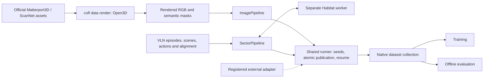

# Generating native datasets

`uv run --locked cofl data generate` constructs observations and instruction-conditioned labels
from source assets and writes native CoFL dataset collections. For CoFL,
`cofl data render` first converts Matterport3D/ScanNet meshes and semantic
annotations into RGB images and semantic masks; `cofl data generate` then
constructs their instruction-conditioned labels. Existing rendered assets can
be used directly. Sector generation starts
from VLN episodes, scene geometry, replay actions, and instruction alignment.
The two adapters share publication and provenance machinery, while retaining
their distinct label algorithms and coordinate profiles.



## Install and configure

Use the [locked uv environment](../README.md#installation) from the repository
root. Its default dependency groups include host-side generation dependencies:

```bash
uv sync --locked
```

Copy the bundled recipes to an editable directory, then set their source paths,
dataset identity, revision, and split:

```bash
uv run --locked cofl data init-generation --output my-recipes
```

This works with a wheel installation and an editable checkout, and refuses to
replace existing configuration files. The checkout also includes the recipes
under `configs/generation/`. Input paths are resolved relative to the
recipe directory. Paths to datasets, simulator assets, and alignment files are
configuration values rather than imports from another project checkout.

The presets are `image.yaml` (with `image_labels.yaml`), `sector_r2r.yaml`, and
`sector_rxr.yaml`. They require your local source assets before running;
environment synchronization does not download datasets or simulator assets.
Generation can use the CPU dependency group described in the installation
guide; keep its group flags on each `uv run` command.

Every recipe has this shared outer structure:

```yaml
method: cofl
dataset_id: my-generated-dataset
revision: static-v1
split: train
source:
  id: my-rendered-scenes
  version: release-1
seed: 42
limit_units: null
num_shards: 1
shard_index: 0
min_free_gb: 5.0
pipeline:
  # Method-specific options from the supplied recipe.
```

The source ID/version describe the input assets; the dataset revision identifies
the output recipe. Actual source files, generator code, package versions, and
unit seeds are recorded separately. Give changed inputs or label rules a new
revision and output directory.

## Required assets

For the preceding mesh-to-image stage, see [Rendering source scenes](rendering.md).
It documents official asset acquisition, the exact input trees, installation of
the optional Open3D dependency, commands for both datasets, and verified resume.
The official repositories and downloaded scene assets are upstream inputs;
CoFL's renderer does not require importing either repository as a Python package.

| Adapter | Inputs | Unit | Output profile |
| --- | --- | --- | --- |
| Image | Scene annotations, label/category mapping, RGB PNGs, integer semantic mask arrays | One rendered view | `image_field_v1` |
| Sector | VLN episode JSON/gzip, Habitat task configuration, renderable scenes and navigation meshes, replay actions, matching fine-grained instruction alignment | One episode | `ground_sector_v1` |

Image source layouts support scene-level views and views inside region
directories. RGB and semantic masks must correspond to the same rendered view.
Scenes provide `annotations.json`; views use `top.png`/`top_mask.npy` or numbered
`view0.png`/`view0_mask.npy` pairs. Each semantic `.npy` stores a dictionary with
`mask` (integer label IDs) and `label_map` (IDs to category names).
The label recipe determines walkable categories, object names, and target
construction. `data generate` does not need a simulator or OpenGL; `data render`
needs an Open3D graphics context. `annotations.json` is currently an existence
gate and fingerprinted input for ImagePipeline; its camera records are not used
to generate instructions, which come from label categories and templates.

Sector generation needs a compatible Habitat runtime. The simulator
environment runs separately from the Python 3.12.12 host process; the sector
adapter's `habitat_python` setting selects that interpreter. Explicit
`runtime_pythonpath` entries make external Habitat task extensions importable.
The worker renders and constructs labels, and the host publishes the native
dataset. Each process uses its own environment and dependencies.

Sector recipes provide `habitat_config`, `dataset_data_path`, `scenes_dir`,
`gt_actions_path`, `subinstructions` (kind and path), `replay_mode`, and
`augmentation`. Select the appropriate R2R or RxR preset instead of assuming
their instruction alignment formats are interchangeable.

The supplied episode file is the inventory: simulator-side scene, episode, and
language filters must not silently remove its entries. An RxR task config must
select exactly one role, such as `guide`, matching that file. Episodes without
matching instruction alignment are explicitly skipped and reported. GT replay
does not silently substitute a follower when actions are missing; follower mode
is a separate recipe.

Replay actions, episode splits, and fine-grained instructions must refer to the
same dataset release and split. R2R and RxR camera settings differ; the selected
recipe must keep RGB/depth/semantic sensor HFOV, visibility tests, and field
geometry consistent. Depth is stored in metres. Ground fields are Cartesian
forward/left vectors even though the model queries a sector chart.

Image recipes set the field, auxiliary-array, and stored-image resolutions
separately. `trajectory.enabled` controls whether every retained field also
requires a valid path. When enabled, `trajectory_state` stores image XY points,
`trajectory_action` stores the next XY position, and `trajectory_valid` with
`trajectory_length` identifies real points within padded arrays. There is one
stored trajectory position array. Disabling trajectory supervision retains
fields, goals, and potential/geodesic labels.

Sector geometry is configured under `augmentation`: `bev_x_max` gives the
forward extent in metres, `bev_resolution` the Cartesian grid spacing, and
`hfov_rad` the horizontal field of view in radians. The supplied recipes use a
5 m extent with 0.1 m spacing and 90° for R2R or 79° for RxR. The vector
normalization scale `v_norm` must equal `bev_x_max`.

## Run, inspect, and resume

Start with one view or episode using your edited recipe:

```bash
uv run --locked cofl data generate --config my-generation.yaml --output runs/generated-preview \
  --limit-units 1 --seed 42
uv run --locked cofl data validate runs/generated-preview
uv run --locked cofl data verify-generation runs/generated-preview
uv run --locked cofl data inspect runs/generated-preview
```

This is a partial dataset. Remove `--limit-units` and use a new output directory
for the complete selected inventory. Filters inside a recipe also define what
that inventory contains; a successful run does not imply that every external
scene or episode release was selected.

Generation writes a `generation.json` journal, immutable native unit shards,
per-unit `generation-report.json` files, and a `collection.json` index. Each unit
is staged and validated before publication. A unit with no labels must record
its skip reason. A failed run does not advertise a complete collection.

Resume with the same recipe and output directory:

```bash
uv run --locked cofl data generate --config my-generation.yaml --output runs/generated-preview \
  --limit-units 1 --seed 42 --resume
```

Resume verifies finalized payloads and the recorded source/configuration/code
identity. It reuses completed units and retries unfinished work. Changing the
recipe, input bytes, relevant code, or recorded environment requires a new
revision and output directory.

`verify-generation` rehashes stored payloads by default. Its `--metadata-only`
option checks recorded identities and receipts without re-reading all payloads;
the result explicitly reports that weaker scope. Source location identities are
also recorded, so relocating assets is not guaranteed to preserve an existing
run's resume identity.

## Reproducibility and process shards

### Historical datasets versus a new deterministic generation

The current generator does **not** guarantee exact reconstruction of the
historical CoFL static-v13 corpus. The existing native corpus was migrated by
copying legacy labels (`exact_source_arrays_no_regeneration`), rather than by
rerunning the source-to-label pipeline. Recorded migration checks establish
equality of decoded copied arrays. They do not establish end-to-end regeneration
equality or identical compressed files.

There are concrete differences to account for:

- Historical camera choices can be replayed from a separately supplied licensed
  camera catalog using
  [`data render --cameras-from`](rendering.md#replay-existing-camera-records).
  The same option accepts a custom catalog or original annotations root.
  Their old random seeds are not needed where complete camera records survive.
  The local archive is missing 270 Matterport view cameras; the remaining
  33,093 records are complete. Matching camera parameters still requires a
  rendered-output comparison to establish pixel equality on a given graphics stack.
- Legacy label generation randomly selected instruction templates, goal
  directions and trajectory starts without per-view seeds. Its parallel writer
  also used task completion order. The new stable seeds cannot recover those
  historical choices or that order.
- The migrated training split preserved 189 observations without labels. The
  current ImagePipeline skips views with no surviving annotations, so its
  observation inventory is different even if valid labels could be matched.
- The separately postprocessed `static_v13_action` variant uses normalized
  displacement actions (`delta_normed_anchor`). The current image recipe emits
  next-position XY actions; those variants are not interchangeable.

Keep the released dataset, its exact train/validation inventory, conversion
receipts and checksums as the reference for reproducing an existing experiment.
Treat a fresh render/generate run as a new dataset revision until it has been
compared against that reference. A full-corpus regeneration comparison has not
been established; the small fixed-seed tests below are regression checks.

### New generation runs

Units are sorted by stable source identity. Each unit gets a seed derived from
the base seed, method, and unit key. Process-shard selection therefore does not
change the seed for an overlapping unit. Python and NumPy random state are
scoped to the unit; simulator randomness must use that seed as well.

Use separate output directories for concurrent processes, for example
`--num-shards 4 --shard-index 0` through `--shard-index 3`. Each individual
process output is a partial corpus. Put all partition directories below their
eventual parent, then verify and combine the complete set:

```bash
uv run --locked cofl data generate --config my-generation.yaml --output runs/generated/part-0 \
  --num-shards 2 --shard-index 0
uv run --locked cofl data generate --config my-generation.yaml --output runs/generated/part-1 \
  --num-shards 2 --shard-index 1
uv run --locked cofl data merge-generation runs/generated/part-0 runs/generated/part-1 \
  --output runs/generated
uv run --locked cofl data verify-generation runs/generated
```

Merge checks partition coverage, recipes, common source fingerprints, and
finalized payloads. It indexes the existing native unit shards in global source
order, without copying their payloads. A limited source selection or an explicitly
partial source remains partial even when all process partitions are present.
An unassigned partition, or one whose units all explicitly skip, completes with
a journal and no readable collection. Include that directory when merging: its
verified journal still establishes partition coverage. A merged selection with
no labels cannot produce a training dataset.

To compare independently generated copies with the same recipe and collection
layout:

```bash
uv run --locked cofl data compare runs/generated-a runs/generated-b --output runs/comparison.json
```

Content equality and sample-order equality are distinct checks. Seed equality
alone cannot establish either one, especially across changed library or simulator
versions. Compare both before relying on independently generated datasets for
the same training experiment. `data compare` accepts native datasets; it is not
a legacy-Zarr converter or a raw PNG/mask comparison tool. Raw rendering receipts
are described in [the rendering guide](rendering.md#outputs-and-resume).

## Training and evaluation boundary

The output is consumed directly by the native dataset reader and training
pipeline. Keep generation receipts with the dataset and run
`uv run --locked cofl data verify-generation` before training. Explicitly set
`allow_partial_dataset: true` only for a pilot that uses a partial corpus.

A generated dataset, deterministic replay, or a short training check is not a
navigation benchmark result. Dataset generation and Habitat benchmark execution
have separate protocols. See [`reproduce/README.md`](../reproduce/README.md) for
the remaining requirements for reported paper measurements.

## Verified scope

Raw-rendering tests cover source layouts, complete RGB/mask/camera publication,
fixed-camera replay, per-scene random seeds, failure recovery and rejection of changed source/output
bytes using a small renderer fixture. This tests the publication contract;
an additional Open3D/Xvfb check rendered both synthetic input layouts and fed
their top views through native field/trajectory generation. See
[rendering verification](rendering.md#verification-and-limits) for its scope.

Software tests exercise a small rendered semantic scene through the image CLI,
native publication, payload verification, same-seed comparison, and resume.
They also cover source mutation, partial-dataset propagation, and rejection of
damaged finalized payloads. Image checks include nearby same-label objects,
occluded target fragments, fixed numerical fields and paths, and generation
with trajectory supervision enabled or disabled. Sharding tests verify that
merging partitions preserves serial generation's content and sample order.

Simulator checks have exercised individual R2R and RxR episodes using a separate
Python 3.7 environment with Habitat-Lab/Sim 0.1.7. Full-corpus generation and
navigation benchmark scores are outside this verification scope. Repeat the
small generation checks in your configured runtime before a full run.

## Extending generation

An adapter exposes `profile`, `recipe_version`, `writer_options`, an inventory of
`GenerationUnit(key, payload, inputs)` values, `generate(unit, writer, seed=...)`,
and `close()`. Register its factory with `register_pipeline`. Unit inputs must
include all files that affect its labels, and keys must identify source content
rather than worker numbers or output rows. A new coordinate representation also
requires a declared dataset profile and validator; the shared runner does not
infer geometry from arrays.

An optional `provenance()` hook records adapter/runtime details such as simulator
versions and external task configuration. Keep that metadata explicit so a
resume check can detect changes outside the host package.
Adapters are responsible for identifying external code revisions and relevant
runtime settings: the shared package code fingerprint does not automatically
hash every installed simulator or third-party Python source file. Persisted
path metadata uses opaque location identities instead of embedding local
absolute paths.
